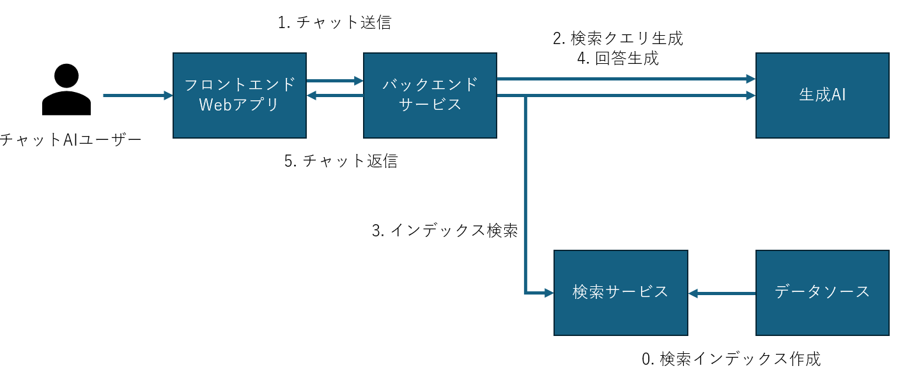
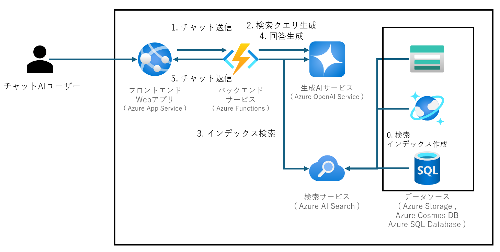

# RAG システムの基礎

- [RAG システムの基礎](#rag-システムの基礎)
  - [概要](#概要)
  - [基本構成](#基本構成)
  - [検索サービス Azure AI Search](#検索サービス-azure-ai-search)
    - [RAG の検索向けのデータのインデックス化機能](#rag-の検索向けのデータのインデックス化機能)
    - [RAG の検索に使用可能なオプション](#rag-の検索に使用可能なオプション)

## 概要
RAG システムは、生成AIの回答生成の際に事実に基づかない回答の生成（ハルシネーション）を防ぐために、信頼できるデータをデータストアに格納し、そのデータストアの検索結果を用いて回答を生成する生成 AI のアーキテクチャです。

本章では、 Azure での RAG の基本構成およびデータの検索に用いられるサービスである Azure AI Search の機能を説明します。

## 基本構成
RAG システムの基本的な構成を紹介します。

RAG システムでは、検索サービスと生成 AI サービスに加え、それらを用いて検索と生成の命令を統合するバックエンドサービスから構成されます。ユーザーが利用する場合には、これらに加えて Web アプリなどの UI が必要となります。

RAG システムでの回答生成の処理の流れは以下の通りです。
 
0. 検索サービスはデータソースに保存したデータをもとに、検索インデックスを作成します。
1. Web アプリは UI 上でユーザーからのチャットを受け付けると、バックエンドサービスにチャットの内容を送信します。  
2. バックエンドサービスは検索を実行する前に、チャットの内容を元に、検索に適したクエリを生成します。
3. 作成した検索クエリを用いて、事前にインデックス化したデータを検索します。
4. その結果とユーザーからのチャットを元に回答を生成 AI サービスに作成するようリクエストします。  
5. 最後に、生成結果を UI に返却して表示します。

Azure のサービスを使用する場合の基本構成は以下の通りです。

フロントエンド Web アプリとして Azure App Service 、バックエンドサービスには Azure Functions を利用し、生成 AI には Azure OpenAI Service を使用します。検索サービスには Azure AI Search を使用します。検索対象となるデータソースのオプションには、 Azure Storage 、 Azure Cosmos DB 、 Azure SQL Database などが挙げられます。

次のセクションでは、本ドキュメントのテーマとなるデータストアの選定のために、 Azure AI Search の概要および RAG システムに利用できる機能を説明します。

## 検索サービス Azure AI Search
[Azure AI Search](https://learn.microsoft.com/ja-jp/azure/search/search-what-is-azure-search) は、 Azure 上で各種データストアに保存されたデータを検索および取得するシステムです。Azure OpenAI Service や Azure Machine Learning とのネイティブ統合を備え、従来のフルテキスト検索に加え、データの意味を理解して検索するベクトル検索など、検索に関する機能が充実しています。主なユースケースには、ナレッジベースの分析、情報検出、取得拡張生成（ RAG ）、自動化などがあります。

### RAG の検索向けのデータのインデックス化機能
- [データのチャンキングとベクトル化](https://learn.microsoft.com/ja-jp/azure/search/search-how-to-semantic-chunking)
  - 非構造化データ（例： PDF や画像）を小さなチャンクに分割し、それぞれをベクトル化して検索インデックスに追加します。これにより、生成AIアプリケーションでの高精度な検索と情報取得が可能になります。
- [AIエンリッチメント](https://learn.microsoft.com/ja-jp/azure/search/cognitive-search-concept-intro)
  - インデクサーは、スキルセットを使用してデータをエンリッチし、検索インデックスに追加します。例えば、画像からテキストを抽出し、そのテキストを翻訳してインデックスに追加するなどの処理が可能です。

### RAG の検索に使用可能なオプション
Azure AI Search でインデックス化したデータを検索する際に、検索精度は重要なポイントになります。そこで、検索精度を向上させるために使用できる機能を紹介します。
- [セマンティック検索](https://learn.microsoft.com/ja-jp/azure/search/semantic-search-overview)
  - 用途: クエリの意味を理解し、関連性の高い結果を返す機能です。
  - 特徴: キーワードベースの検索に比べて、ユーザーの意図をより正確に捉えることができます。これにより、生成AIがより適切な情報を取得し、応答の質を向上させます。
- [クエリ書き換え](https://learn.microsoft.com/ja-jp/azure/search/semantic-how-to-query-rewrite)
  - 用途: ユーザーのクエリを自動的に書き換え、より効果的な検索結果を得るための機能です。
  - 特徴: 曖昧なクエリや不完全なクエリを改善し、検索精度を向上させます。これにより、生成AIがより正確な情報を基に応答を生成できます。
- [セマンティックランカー](https://learn.microsoft.com/ja-jp/azure/search/semantic-search-overview)
  - 用途: 検索結果を意味的にランク付けし、最も関連性の高い結果を上位に表示する機能です。
  - 特徴: 検索結果の品質を向上させ、生成 AI が最も関連性の高い情報を利用できるようにします。これにより、ユーザーの質問に対するより正確で有用な応答が可能になります。

また、検索の際はキーワード検索だけではなく、ベクトル検索およびその二つを組み合わせたハイブリッド検索も可能です。
- [ベクトル検索](https://learn.microsoft.com/ja-jp/azure/search/vector-search-overview):
  - 用途: データをベクトル形式で検索し、類似度に基づいて結果を返す機能です。
  - 特徴: 高度な類似性検索を実現し、生成AIが関連性の高い情報を効率的に取得できます。
- [ハイブリッド検索](https://learn.microsoft.com/ja-jp/azure/search/hybrid-search-overview):
  - 用途: キーワード検索とベクトル検索を組み合わせた検索機能です。
  - 特徴: 両方の検索手法の利点を活かし、より包括的な検索結果を提供します。

