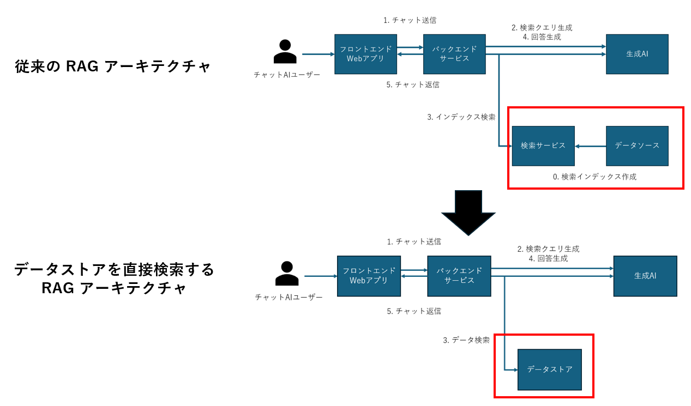
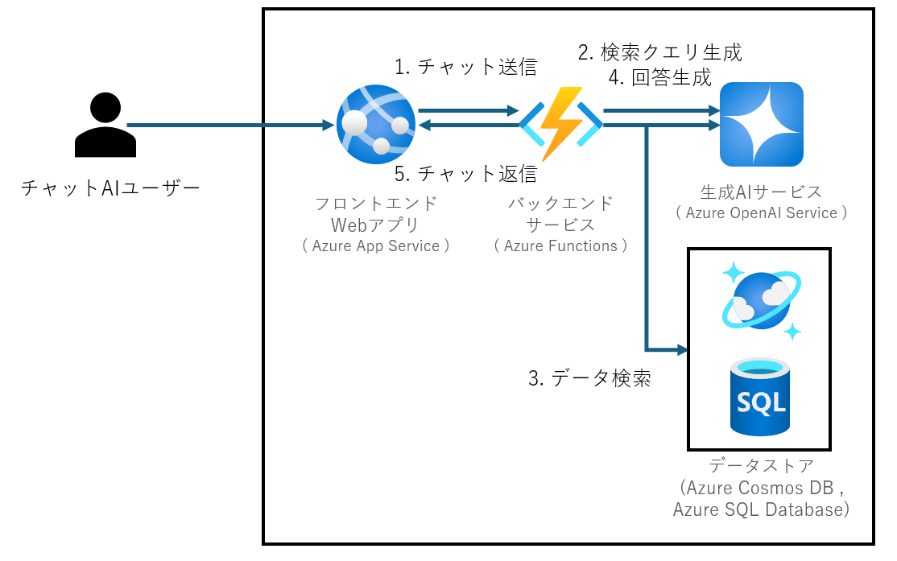
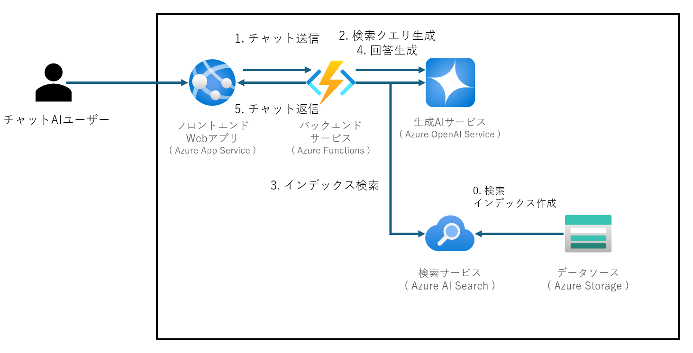
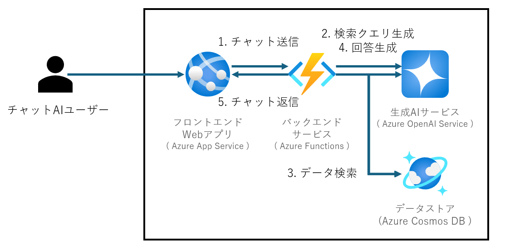
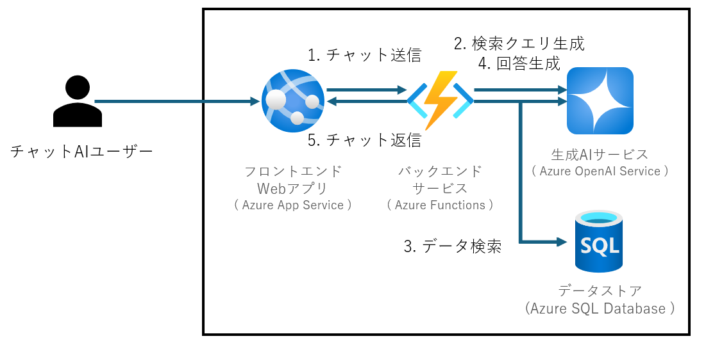
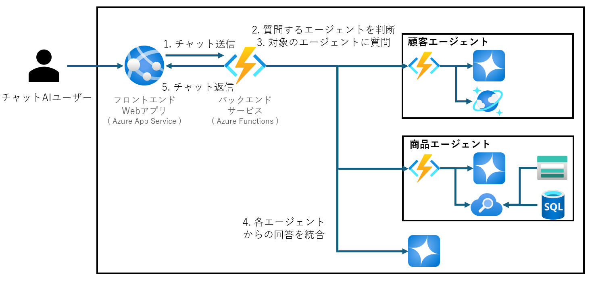

# RAG システムにおける各種データストアの使い分け

- [RAG システムにおける各種データストアの使い分け](#rag-システムにおける各種データストアの使い分け)
  - [概要](#概要)
  - [アーキテクチャ構成](#アーキテクチャ構成)
  - [各種サービスの比較](#各種サービスの比較)
    - [比較の観点](#比較の観点)
  - [ユースケース例およびアーキテクチャ](#ユースケース例およびアーキテクチャ)
    - [Azure AI Search を選択する場合](#azure-ai-search-を選択する場合)
      - [ユースケース](#ユースケース)
      - [アーキテクチャ](#アーキテクチャ)
    - [Azure Cosmos DB を選択する場合](#azure-cosmos-db-を選択する場合)
      - [ユースケース](#ユースケース-1)
      - [アーキテクチャ](#アーキテクチャ-1)
    - [Azure SQL Database を選択する場合](#azure-sql-database-を選択する場合)
      - [ユースケース](#ユースケース-2)
      - [アーキテクチャ](#アーキテクチャ-2)
    - [複数のデータストアを併用する場合](#複数のデータストアを併用する場合)
      - [ユースケース](#ユースケース-3)
      - [アーキテクチャ](#アーキテクチャ-3)

## 概要
本章では、 RAG システムの検索サービスとして使用されるサービスの選択基準について議論します。

より具体的には、従来 RAG システムでは検索サービスをデータソースに接続するアーキテクチャが採用されてきましたが、検索サービスを介さずに直接データストアを検索するアーキテクチャが選択肢に入るようになりました。そこで、その方法を説明するとともに各方法を比較し、それらが活用できるユースケースを示します。

## アーキテクチャ構成
RAG システムにおいて、検索サービスを仲介せず、データストアに対して直接検索を行う場合は、以下の構成に変化します。

Azure を用いた場合には、データストアを直接検索する RAG システムの構成例として、以下のような構成が挙げられます。

従来の RAG システムでは検索サービスを使用していましたが、ここではデータストアサービスである Azure Cosmos DB や Azure SQL Database に置き換えます。これによって、検索するデータストアを選択して直接検索することが可能になります。

## 各種サービスの比較
### 比較の観点

| サービス         | スケーラビリティ | 金額 | セキュリティ | 可用性 |  
|------------------|------------------|--------|--------------|--------|  
| Azure AI Search  | △               | △      | 〇           | 〇     |  
| Azure Cosmos DB   | ◎               | 〇      | 〇           | ◎     |  
| Azure SQL Database           | △               | 〇      | 〇           | 〇     |  

- スケーラビリティ
  - Azure Cosmos DB は分散データベースであり、グローバル分散や自動スケーリング機能を備えているため、スケールアウトに優れています。これにより、大規模なデータセットに対しても高速な検索が可能です。一方、Azure SQL Database はスケールアウトが難しく、スケーラビリティに限界があります。
- 金額
  - Azure AI Search はデータソースを必要とするため、Azure Cosmos DB や Azure SQL Database といったデータソースの費用に加えて Azure AI Search の費用が追加で発生します。また、高い可用性やスケーラビリティを確保する場合は追加のレプリカを作成する必要があるため、本番環境ではコストが増加する可能性があります。
- セキュリティ
  - 各サービスはデータの暗号化やアクセス制御機能を提供しており、セキュリティを担保するための機能を備えています。具体的には、各種サービスで閉域構成が可能な他、 Azure Cosmos DB と Azure SQL Database は、保管するデータの暗号化がサポートされています。
- 可用性
  - Azure Cosmos DB は複数リージョン書き込みを使用した場合に SLA が 99.999% まで保証されます。一方 Azure AI Search ではレプリカ 3 つ作成した場合でも SLA が 99.9% であり、可用性が重視されるワークロードでは Azure Cosmos DB の方が優先されます。

## ユースケース例およびアーキテクチャ
各検索サービスおよびデータストアサービスの特徴に基づいて、各サービスを使用した RAG システムのユースケースを説明します。
ここでは、フロントエンドWebアプリ、バックエンドサービス、生成 AI および各種検索サービスまたはデータストアサービスからなるアーキテクチャを用いて説明します。[^1] 
また、データストアは、 CSV 形式や PDF 、リレーショナルデータなど、保存したいデータの種類によって使い分けます。

[^1]: ※実際の構成では、要件によってネットワークの閉域化や監視、ログ出力などの要素が追加される場合があります。

### Azure AI Search を選択する場合
#### ユースケース
- 状況設定: 
  - 大規模な組織の社内ヘルプデスクで、従業員が会社のリソースやドキュメントに効率的にアクセスできるようにしたい。
- 活用できる検索の例
  - ドキュメント検索: 従業員が会社の既定やマニュアル、技術ガイドといったドキュメントを検索できます。検索結果はキーワードだけでなく、ドキュメントの内容や文脈に基づいて類似のドキュメントを見つけます。
  - ナレッジベース検索: 従業員がよくある問題の解決策をナレッジベースで検索できます。過去のクエリやインタラクションに基づいて関連する記事を推奨し、ハイブリッド検索を使用して最も関連性の高いコンテンツを提案します。

#### アーキテクチャ

このアーキテクチャでは、Azure AI Search を中心に、異なる種類のデータを統合して一括で検索できます。以下に各コンポーネントの役割を説明します。

- Azure AI Search: 
  - 検索エンジンとして機能し、ユーザーの検索クエリに対して各データソースから作成したインデックスに対して検索を実施します。
- Azure Storage:
  - PDF や Office ファイルといった様々な形式のファイルを保存します。これらのファイルは Azure AI Search によってインデックス化することでまとめて検索可能になります。

### Azure Cosmos DB を選択する場合
#### ユースケース
- 状況設定: 
  - グローバルに展開するソーシャルメディアプラットフォームで、ユーザーデータを分散管理し、低遅延で高可用性を実現したい。
- ハイブリッド検索やベクター検索のユースケース:
  - ユーザー検索: ユーザーが他のユーザーを検索する際に、名前やプロフィール情報だけでなく、興味や活動履歴に基づいた検索結果を提供。ベクター検索を用いて、類似した興味を持つユーザーを見つける。
  - コンテンツ検索: 投稿されたコンテンツを検索する際に、キーワード検索だけでなく、コンテンツの意味や関連性に基づいた検索結果を提供。ハイブリッド検索を用いて、テキスト、画像、動画などの異なる形式のコンテンツを統合的に検索する。

#### アーキテクチャ

このアーキテクチャでは、 Azure Cosmos DB に対してデータ検索を行います。 Azure Cosmos DB には、ユーザーのプロフィール情報、興味、活動履歴などに加えて、投稿されたテキスト等のコンテンツをドキュメント形式で格納します。

### Azure SQL Database を選択する場合
#### ユースケース
- 状況設定: 
  - 金融機関のトランザクションシステムで、データ整合性とセキュリティを重視しながら、検索サービスを別途用意することなく複雑なクエリを実行したい。
- 使用例:
  - トランザクション管理: 銀行の取引データをリアルタイムで管理し、データの整合性を確保。
  - 複雑なクエリの実行: 顧客の取引履歴や口座情報に対して複雑なクエリを実行し、レポートを生成する。
  - セキュリティ: データ暗号化やアクセス制御を強化し、顧客データを保護する。
- ベクトル検索のユースケース:
  - 不正取引検出: 顧客の取引データをベクター検索で分析し、異常なパターンや不正取引を検出。過去の不正取引データと比較して、類似した取引を特定する。
  - 顧客サポート: 顧客からの問い合わせに対して、過去の問い合わせ履歴や関連するドキュメントをハイブリッド検索で迅速に検索し、最適な回答を提供する。

#### アーキテクチャ

このアーキテクチャでは、 Azure SQL Database に対してデータ検索を行います。Azure SQL Database には銀行の取引データのようなトランザクションデータや顧客データをリレーショナル形式で格納します。

### 複数のデータストアを併用する場合
RAG システムを構築する際、複数ドメインにまたがるデータが異なるデータストアに保管されている場合にドメインごとに RAG システムを構築し、それらをエージェントと呼ぶことがあります。

ここでは、各ドメインごとのエージェントおよびそれらを統合するエージェントからなるマルチエージェントシステムを用いた、パーソナライズされた商品推薦システムを説明します。

#### ユースケース
- 状況設定: 
  - ドメインごとに異なるデータを持ったシステムで、ユーザーにパーソナライズされた商品推薦を行いたい。
- マルチエージェントの RAG のユースケース
  - 顧客エージェント: 顧客に関する情報を検索し、回答を生成する。
  - 商品エージェント: 商品に関する情報を検索し、回答を生成する。
  バックエンドサービス: ユーザーの質問から、使用するエージェントを選択する。顧客エージェントと商品エージェントからの情報を統合し、ユーザーに最適な商品を推薦する。

#### アーキテクチャ

このアーキテクチャでは、各ドメインのデータストアを含む複数のエージェントを用いて回答生成を行います。以下に各エージェントの役割を説明します。

- 顧客エージェント
  - RAG システムの基本構成としてバックエンドサービスおよび生成 AI を配置し、顧客データを Azure Cosmos DB に保管します。
- 商品エージェント
  - RAG システムの基本構成としてバックエンドサービスおよび生成 AI を配置し、メタデータや画像を含む商品データを Azure SQL Database や Azure Storage に保管します。各商品データは Azure AI Search によってインデックス化されます。

このように、各ドメインについてそれぞれ RAG システムを構築することで、一つのデータストアにデータを集約させることなく 回答生成が可能になります。また、検索サービスや生成 AI といったデータ以外の要素についても、エージェントごとにデータに個別最適化したサービスを選択できます。
